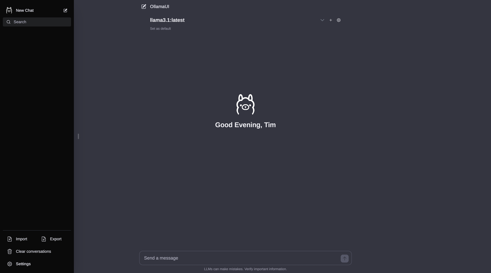

# OllamaUI 🦙
OllamaUI is a streamlined version of the original OpenWebUI. This project is now maintained as part of the ArtyLLaMa Research Project, with the primary development continuing at [OpenWebUI.org](https://openwebui.org).


## About This Fork
This repository represents a previous version of OpenWebUI, maintained to provide a simplified user interface with essential features and reduced complexity. Our focus is on maintaining a lean, efficient, and user-friendly experience.

## Philosophy
Unlike the feature-rich approach of OpenWebUI.com, this fork is committed to maintaining a minimalist design. We believe in the power of simplicity and aim to provide a straightforward, efficient interface for interacting with Ollama models.

## Features ⭐
The current version includes core functionalities such as:
- Pulling and deleting models
- Engaging in conversations with one or multiple models
- Chat import/export
- Vision model support (LLaVA, Llama3.2-Vision)
  - Image upload and analysis
  - Drag and drop support
  - Multi-model conversations

We intend to keep these essential features while focusing on stability, performance, and code quality.

## Installation 🚀

### Prerequisites
- [Ollama](https://ollama.ai/) running at http://localhost:11434 (version 0.1.17 or later for vision support)
- Node.js installed
- Yarn for dependency management

### Setup
1. Clone the repository:
   ```bash
   git clone https://github.com/ArtyLLaMa/OllamaUI.git
   cd OllamaUI
   ```

2. Install dependencies using Yarn:
   ```bash
   yarn install
   ```

3. Run in development mode:
   ```bash
   yarn dev
   ```
   Access OllamaUI at http://localhost:3000



## Vision Models Support 👁️
OllamaUI supports the following vision-capable models:
- Llama3.2-Vision (requires 8GB+ VRAM)
- Llama3.2-Vision:90b (requires 64GB+ VRAM)
- LLaVA (requires 8GB+ VRAM)

To use vision capabilities:
1. Select a vision-capable model from the dropdown
2. Upload images via the image button or drag & drop
3. Ask questions about the images or let the model analyze them

### Vision Model Setup
```bash
# Install a vision-capable model
ollama pull llama3.2-vision
# or
ollama pull llava
```

## Model Compatibility
| Model | Type | VRAM Required | Features |
|-------|------|---------------|-----------|
| llama3.2-vision | Vision | 8GB+ | Image analysis, OCR |
| llama3.2-vision:90b | Vision | 64GB+ | Enhanced image understanding |
| llava | Vision | 8GB+ | General image analysis |
| llama2 | Text | 8GB+ | Text generation |
| mistral | Text | 8GB+ | Text generation |
| codellama | Text | 8GB+ | Code generation |

## Development Features
- TypeScript support
- SvelteKit framework
- TailwindCSS for styling
- Dark/Light mode support
- Mobile-responsive design
- Vision model integration
- Real-time chat streaming
- Model performance metrics

## Contributing
We welcome contributions! Please:
1. Fork the repository
2. Create a feature branch
3. Submit a pull request
4. Follow our coding standards
5. Add tests if applicable

## Related Projects
For those interested in a more feature-rich experience, you may want to explore:
- [ArtyLLaMa](https://github.com/ArtyLLaMa/ArtyLLaMa) - AI-Powered Creative Platform for Interactive Content

## License 📜
This project is licensed under the MIT License. See the [LICENSE](LICENSE) file for details.

## Support 💬
For questions, suggestions, or assistance:
- Open an issue in this GitHub repository
- Visit our [main project repository](https://github.com/ArtyLLaMa) for broader discussions and updates

---
<sup> © 2024 ArtyLLama Research Project | A core initiative of [Kroonen.ai](https://www.kroonen.ai), dedicated to advancing AI-driven creativity and computational research. </sup>
